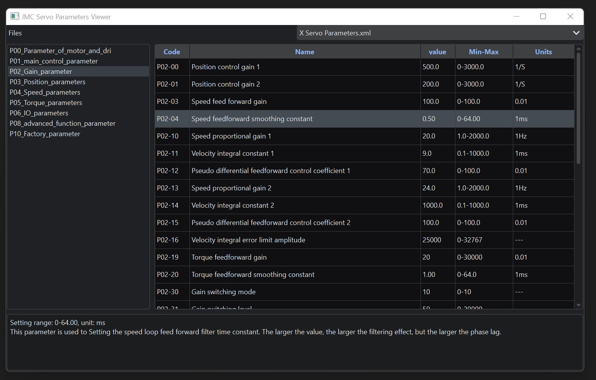

# JMC-Servo-Parameter-Viewer

A simple GUI for viewing the servo paramaters for JMC based servos that have been saved in XML format.

I’m not sure why the official tool can’t do things like allow you to view params without being directly connected to a servo. Let me know if you can think of anything that would be useful to add to this. When I get some time I’ll add a diff/comparator checker thing so it’s easier to see that has changed with your params. 

